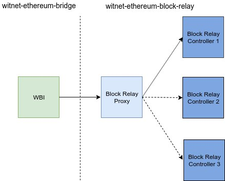

# witnet-ethereum-block-relay [](https://travis-ci.com/witnet/witnet-ethereum-block-relay)

`witnet-ethereum-block-relay` is an open source implementation of Witnet Block Relay for EVM-compatible blockchains.

DISCLAIMER: this is a work in progress, by which we mean the contract could still be vulnerable to attacks. Use at your own risk.


## About WBI and the Block Relay

The Bridge Nodes interact through the Witnet Bridge Interface (hereafter, "WBI"): a smart contract in charge of facilitating the communication between Witnet and smart contract platforms, such as Ethereum, click [here][wbi] for more information.
The block headers in Witnet need to be available to the WBI, meaning that those headers need to be stored in some contract in Witnet, the Block Relay. In order to assure the validity of these block headers, the Block Relay must guarantee a consensus protocol and a Finality Gadget. The documentation about the stages of the Block Relay can be found [here][block-relay].


## Connecting the Bridge and the Block Relay

Due to the above, the more isolated the Block Relay and the WBI are, the more secure they are. Considering this, a proxy contract has been implemented, which connects to the WBI and from which the Block Relay is called. This allows to upgrade the Block Relay when necessary.
The following diagram shows the flow between the WBI and the Block Relay.

<p align=center>

</p>
<p align=center>
<em>Fig. 1: Connecting the WBI to the Block Relay.</em>
</p>

The proxy contract has the `upgradeBlockRelay` function which is in charge of asking the controller if replacing it is allowed. If it is, the controller to which the proxy points can be changed.

In order not to lose the state of the replaced controller, the proxy maintains a mapping between the last block stored by each of the controllers. When asking for a specific block in a specific epoch, the proxy derives the controller it should ask to, and computes operations against it. In summary, the state of the replaced controllers is maintained. This is important, as replacing block relay controllers without taking into account previous states might leave data requests in an unverifiable state.


## BlockRelay based on ABS

The `ActiveBridgeSetBlockRelay` is a work in progress contract that implements the Active Bridge Set (ABS) as the set in charge of proposing and posting blocks to the Block Relay. The ABS is a subset of bridge nodes and is updated in the contract when posting a block through the WBI.

A block header is later finalized when 2/3 of the ABS agree on a vote. More precisely, the flow is as follows:

1. During each epoch, the members of the ABS (Active Bridge Set) propose votes for the previous epoch. The vote contains the previous vote that it extends.
2. When the epoch is changed and another vote is proposed, if 2/3 of the members achieved consensus on a vote, the ´postNewBlock´ function is automatically called.
3. When a vote is posted in the Block Relay, the previous votes that extends are finalized as well. If the previous vote is already finalized, it simply asserts that the vote that it extends is the correct one (i.e. the last block).

The finality implemented in this contract is foundamental for the final purpose of a decentralized block relay. However the use of the ABS as the voting committee must be changed since these nodes are prone to Sybil attacks. Check the [Future steps](#future-steps) section to understand better the block relay design.

Limitations:

1. When a block is finalized by the ABS, it finalizes the previous pending ones (if needed). This means that may happen that the members of ABS for an epoch _n_ are the ones finalizing votes for epochs in which they were not members.


## Contracts

This repository contains a proxy and two Block Relay contracts: the first is centralized and the second is ABS-based.


### BlockRelayProxy

The `BlockRelayProxy` is the proxy contract called by the WBI when deployed. It contains the following methods:

- **upgradeBlockRelay**:
  - _description_: upgrades the address of the block relay.
  - _inputs_:
    - *_newAddress_*: Address of the block relay to be upgraded.

- **getLastBeacon**:
  - _description_: calls the last beacon from the block relay
  - _output_:
    - the last beacon as byte concatenation of (block_hash||epoch).

- **verifyDrPoi**:
  - _description_: verifies the validity of a data request PoI against the DR merkle root
  - _inputs_:
    - *_poi_*: proof of inclusion as [sibling1, sibling2,..].
    - *_blockHash* the blockHash
    - *_epoch*: the epoch the block was proposed for.
    - *_index* the index in the merkle tree of the element to verify
    - *_element* the leaf to be verified

- **verifyTallyPoi**:
  - _description_: verifies the validity of a PoI against the tally merkle root
  - _inputs_:
    - *_poi_*: proof of inclusion as [sibling1, sibling2,..].
    - *_blockHash* the blockHash
    - *_epoch*: the epoch the block was proposed for.
    - *_index* the index in the merkle tree of the element to verify
    - *_element* the leaf to be verified

- **getController**:
  - _description_: selects the controller based on the epoch
  - _inputs_:
    - _epoch_: the epoch which we want to work withs
  - _output_:
    - the address of the corresponding controller.
  

### CentralizedBlockRelay

The `CentralizedBlockRelay` contract contains the following methods:

- **postNewBlock**:
  - _description_: posts a new block into the block relay.
  - _inputs_:
    - *_blockHash*: Hash of the block header.
    - *_drMerkleRoot*: the root hash of the requests-only merkle tree as contained in the block header.
    - *_tallyMerkleRoot*: the root hash of the tallies-only merkle tree as contained in the block header.

- **readDrMerkleRoot**:
  - _description_: retrieves the requests-only merkle root hash that was reported for a specific block header.
  - _inputs_:
    - *_blockHash*: hash of the block header.
  - _output_:
    - requests-only merkle root hash in the block header.

- **readTallyMerkleRoot**:
  - _description_: retrieves the tallies-only merkle root hash that was reported for a specific block header.
  - _inputs_:
    - *_blockHash*: hash of the block header.
  - _output_:
    - tallies-only merkle root hash in the block header.

  **getLastBeacon**:
  - _description_: retrieves the last beacon that was inserted in the block relay.
  - _output_:
    - the last beacon as byte concatenation of (block_hash||epoch).

  **verifyDrPoi**:
  - _description_: verifies the validity of a data request PoI against the DR merkle root
  - _inputs_:
    - *_poi_*: proof of inclusion as [sibling1, sibling2,..].
    - *_blockHash* the blockHash
    - *_index* the index in the merkle tree of the element to verify
    - *_element* the leaf to be verified

- **verifyTallyPoi**:
  - _description_: verifies the validity of a PoI against the tally merkle root
  - _inputs_:
    - *_poi_*: proof of inclusion as [sibling1, sibling2,..].
    - *_blockHash* the blockHash
    - *_index* the index in the merkle tree of the element to verify
    - *_element* the leaf to be verified


### ActiveBridgeSetBlockRelay

The `ActiveBridgeSetBlockRelay` contract is similar to the `CentralizedBlockRelay` but instead of being centralized, the members of the ABS are in charge of proposing blocks.
The following functions differ from the `CentralizedBlockRelay`:

- **proposeBlock**:
  - _description_: proposes a new block candidate to be considered for inclusion in the block relay.
  - _inputs_:
    - *_blockHash*: Hash of the block header.
    - *_epoch*: the epoch the block is proposed for, it has to be one epoch previous to the current epoch.
    - *_drMerkleRoot*: the root hash of the requests-only merkle tree as contained in the block header.
    - *_tallyMerkleRoot*: the root hash of the tallies-only merkle tree, as contained in the block header.
    - *_previousVote*: the previousVote that this proposed block's vote extends.

- **postNewBlock**:
  - _description_: posts a new block into the block relay.
  - _inputs_:
    - *_vote*: the vote to be posted, this is the hash of the concatenation of the inputs of ´proposeBlock´.
    - *_blockHash*: Hash of the block header.
    - *_epoch*: the epoch for which the block was proposed.
    - *_drMerkleRoot*: the root hash of the requests-only merkle tree as contained in the block header.
    - *_tallyMerkleRoot*: the root hash of the tallies-only merkle tree as contained in the block header.
    - *_previousVote*: the previousVote that this posted block's vote extends.


## Known limitations:

- `CentralizedBlockRelay`: as the name suggests, this block relay is centralized, only the deployer of the contract is able to push blocks.
- `ActiveBridgeSetBlockRelay`: the ABS stays the same until a block is finalized. A block can be proposed more than once by the same ABS member and only for one epoch previous to the current epoch.


## Benchmark

```bash
·--------------------------------------------------------|---------------------------|----------------------------·
|          Solc version: 0.6.12+commit.27d51765          ·  Optimizer enabled: true  ·         Runs: 200          │
·························································|···························|·····························
|  Methods                                               ·                                                        │
······························|··························|·············|·············|·············|···············
|  Contract                   ·  Method                  ·  Min        ·  Max        ·  Avg        ·  # calls     │
······························|··························|·············|·············|·············|···············
|  ActiveBridgeSetBlockRelay  ·  proposeBlock            ·      89877  ·     365059  ·     230565  ·          37  │
······························|··························|·············|·············|·············|···············
|  ActiveBridgeSetMock        ·  pushActivity            ·      48957  ·      63957  ·      56100  ·          21  │
······························|··························|·············|·············|·············|···············
|  ActiveBridgeSetMock        ·  setAbsIdentitiesNumber  ·          -  ·          -  ·      23063  ·           1  │
······························|··························|·············|·············|·············|···············
|  BlockRelayProxy            ·  upgradeBlockRelay       ·      48913  ·      89777  ·      73257  ·           5  │
······························|··························|·············|·············|·············|···············
|  CentralizedBlockRelay      ·  postNewBlock            ·      46740  ·     106740  ·      80274  ·          39  │
······························|··························|·············|·············|·············|···············
|  Deployments                                           ·                                         ·  % of limit  │
·························································|·············|·············|·············|···············
|  ActiveBridgeSetMock                                   ·          -  ·          -  ·     167965  ·       2.5 %  │
·························································|·············|·············|·············|···············
|  BlockRelayProxy                                       ·          -  ·          -  ·     661658  ·       9.8 %  │
·························································|·············|·············|·············|···············
|  CentralizedBlockRelay                                 ·          -  ·          -  ·     583196  ·       8.7 %  |
·--------------------------------------------------------|-------------|-------------|-------------|--------------·
```


## Future steps

The next step is to integrate a block relay based on the Active Reputation Set (ARS), whose members had attained enough reputation and so as to be considered honest, please [follow the link][reputation-system] to learn more about how the Reputation system in Witnet works.

By doing so, it must include the ARS merklelization, as well as the proof-of-memberhip verification. Additionally, the Finality Gadget and BLS signatures should be implemented. More details can be found [here][block-relay].

[reputation-system]: https://github.com/witnet/research/blob/master/reputation/docs/initialization.md
[block-relay]: https://github.com/witnet/research/blob/master/bridge/docs/block_relay.md
[wbi]: https://github.com/witnet/research/blob/master/bridge/docs/WBI.md


## License

`witnet-ethereum-block-relay` is published under the [MIT license][license].

[license]: https://github.com/witnet/witnet-ethereum-bridge/blob/master/LICENSE
